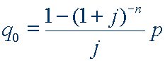

# calculadora-cidadao

  

Financiamento de Prestações Fixas

Fonte: [bcb.gov.br](https://www3.bcb.gov.br/CALCIDADAO/publico/exibirMetodologiaFinanciamentoPrestacoesFixas.do?method=exibirMetodologiaFinanciamentoPrestacoesFixas)
