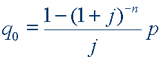

# calculadora-cidadao

  [](https://github.com/psf/black)


Financiamento de Prestações Fixas



Fonte: [bcb.gov.br](https://www3.bcb.gov.br/CALCIDADAO/publico/exibirMetodologiaFinanciamentoPrestacoesFixas.do?method=exibirMetodologiaFinanciamentoPrestacoesFixas)

## Comandos

```shell
uv init
uv add fastapi[all]
uv run uvicorn main:app
```

```shell
python -m venv venv
venv\Scripts\activate
pip install fastapi[all]
uvicorn main:app
````

